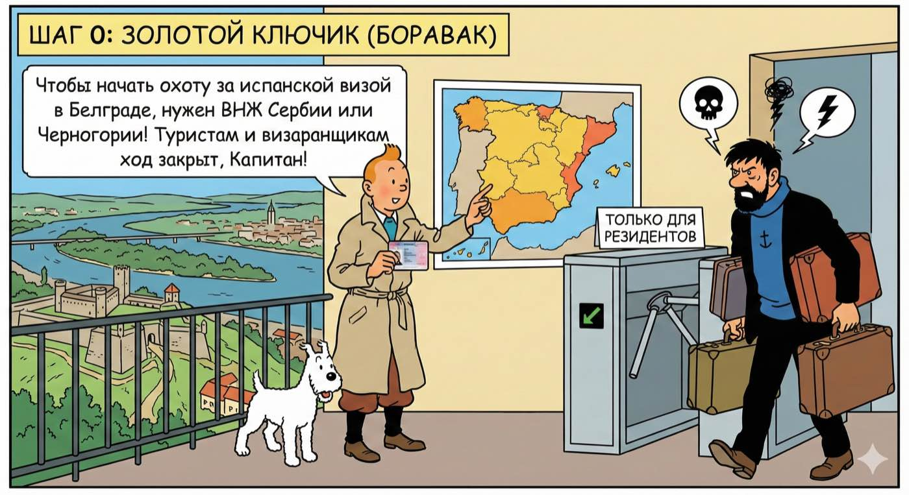
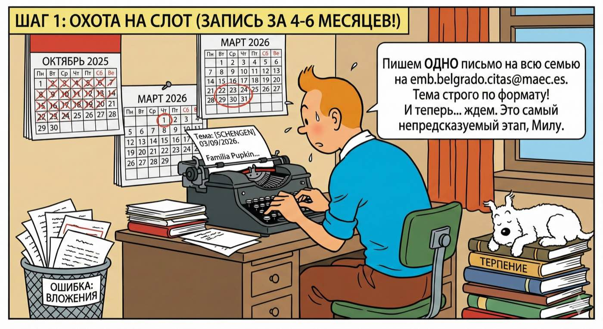
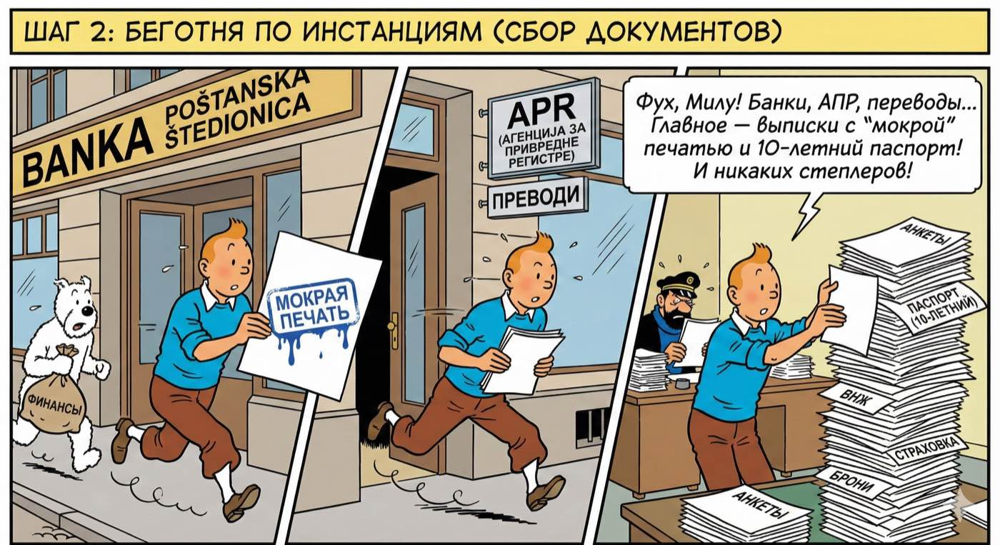
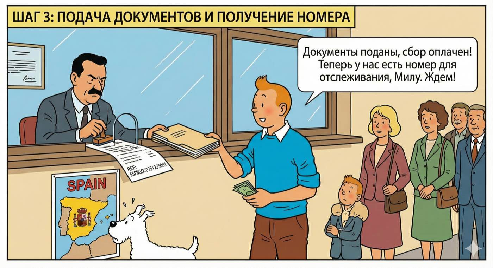
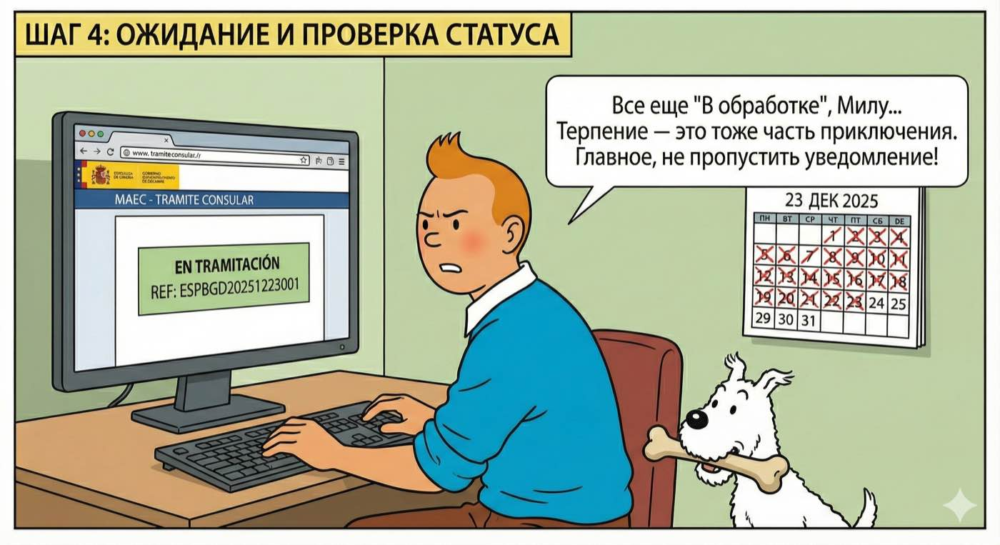
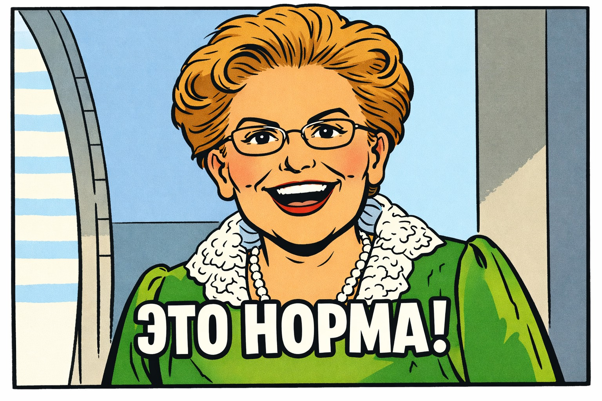
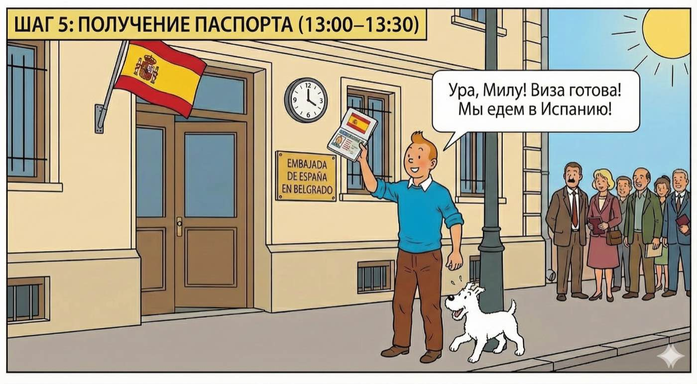
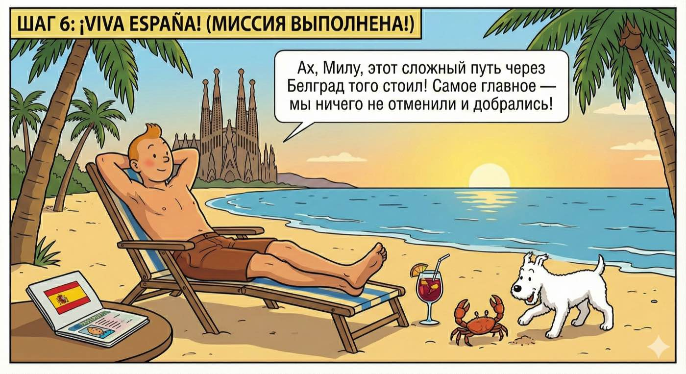

# Как получить испанскую туристическую визу (тип С) в Белграде (для граждан РФ)

*Последнее обновление: 23 февраля 2026*

> [!NOTE]
> Этот гайд — про **туристическую визу (тип C)**. По вопросам **digital nomad визы (тип D)** Испании есть отдельный чат: **[DN виза Испании в Белграде](https://t.me/digitalnomadspainserbia)**.

> [!IMPORTANT]
> **Коротко о главном (актуально на февраль 2026):**
> Визу выдают **за 1–2 дня до вылета** — даже если паспорт сдали 2–3 месяца назад. Известных случаев, когда визу выдали позже даты вылета, нет.

## Контакты и базовая информация
* **Адрес:** Prote Mateje 45, 11000 Beograd ([Google Maps](https://maps.app.goo.gl/WCydYAfdzLodEfct8) | [Яндекс.Карты](https://yandex.com/maps/-/CLVAeT4o))
* **Email для записи:** [emb.belgrado.citas@maec.es](mailto:emb.belgrado.citas@maec.es)
* **Email для получения уведомлений:** [emb.belgrado.info@maec.es](mailto:emb.belgrado.info@maec.es) — **не пишите сюда сами!** С этого адреса консульство присылает дозапросы документов, уведомления о готовности визы или отказе (тема письма: "Solicitud de visado")
* **Выдача паспортов:** 13:00–13:30 (строго)
* **Консульский сбор:** 10 520 RSD на взрослого, **наличными** (карты не принимаются). Для детей 6-12 лет — **в 2 раза меньше**. Дети до 6 лет — **бесплатно**. Сумма может меняться в зависимости от внутреннего курса консульства. Актуально на октябрь 2025.
* **Статус дела:** [https://sutramiteconsular.maec.es/](https://sutramiteconsular.maec.es/)  → `VISADO` → номер дела → год рождения
* **Когда подавать (официально):** не ранее чем за 180 дней и не позднее чем  за 3–4 месяца, оптимально планировать подачу за **3–6 месяцев**.

---

## Нерабочие дни консульства в 2026 году

<details>
<summary>Полный список выходных дней (14 дней) *[подробнее]*</summary>

| Дата | День недели | Праздник |
|------|-------------|----------|
| **1 января** | четверг | **Новый год** |
| **2 января** | пятница | **Новый год (дополнительный выходной)** |
| **6 января** | вторник | **Богоявление / "Три короля" (католический праздник)** |
| **7 января** | среда | **Православное Рождество** |
| **16 февраля** | понедельник | **День государственности Сербии (национальный праздник Сербии)** |
| **3 апреля** | пятница | **Страстная пятница (католическая)** |
| **10 апреля** | пятница | **Страстная пятница (православная)** |
| **1 мая** | пятница | **Праздник труда (1 мая)** |
| **15 августа** | суббота | **Успение Богородицы** |
| **12 октября** | понедельник | **Национальный день Испании** |
| **11 ноября** | среда | **День перемирия (окончание Первой мировой войны — официальный день в Сербии)** |
| **7 декабря** | понедельник | **День Конституции Испании** |
| **8 декабря** | вторник | **Непорочное зачатие Девы Марии (католический праздник)** |
| **25 декабря** | пятница | **Рождество Христово (католическое)** |

</details>

---

## Шаг 0. Кто может подавать



* Требуется действующий **ВНЖ/боравак (боравишна дозвола) Сербии или Черногории** (в т.ч. временный/постоянный).
* **Визаранщики** (без ВНЖ, въезд-выезд по безвизу) **податься не могут**.

<details>
<summary><strong>Нет требования о минимальном сроке проживания (6 мес.)</strong> — почему *[подробнее]*</summary>

В Регламенте закона 4/2000 (испанское визовое законодательство) **нет требования о минимальном сроке проживания** (6 месяцев). На практике принимают с любым действующим ВНЖ, главное чтобы он был действителен на момент подачи и покрывал период поездки.

</details>

---

## Шаг 1. Запись на подачу (получить «слот»)



1. Напишите на **[emb.belgrado.citas@maec.es](mailto:emb.belgrado.citas@maec.es)** **одно письмо на всю семью/всех заявителей** (не отдельные письма на каждого!).
2. **Тема:** `[SCHENGEN] ДД/ММ/ГГГГ` (дата начала поездки, заглавными внутри квадратных скобок).
3. **Тело письма:**

   * Nombre y apellidos (Имя Фамилия как в загранпаспорте, латиницей)
   * Número de pasaporte (только серия+номер)
   * Для детей: Fecha de nacimiento (дата рождения)

**Тема/Заголовок письма:**
```
[SCHENGEN] 03/09/2026
```

**Пример письма:**
```
Estimados señores,

Solicitamos una cita para visado Schengen.

Nombre y apellidos: Petr PUPKIN
Número de pasaporte: 733456789

Nombre y apellidos: Anna PUPKINA
Número de pasaporte: 737654321

Nombre y apellidos: Ivan PUPKIN
Número de pasaporte: 736789123
Fecha de nacimiento: 15/03/2020

Muchas gracias.
Familia Pupkin
```

4. Ждите ответ. Повторно пишите **только** если нет ответа **10 рабочих дней**.

<details>
<summary><strong>Что делать, если не ответили в течение 10 дней</strong> *[подробнее]*</summary>

Повторное письмо можно отправить с другого email-адреса. Есть слухи, что письма с доменов `.ru` могут игнорироваться — по возможности используйте Gmail или другую нейтральную почту.

</details>

<details>
<summary><strong>Частые ошибки при записи</strong> *[подробнее]*</summary>

Вложения с копиями документов; тема не по формату; отсутствие даты в теме; несколько писем подряд.

</details>

**Реалии:** Слот — самый непредсказуемый этап. Запрашивайте максимально заранее, за **4–6 месяцев**. Сезонность и дефицит слотов; ответы «нет доступных дат» обычны — пробуйте позже.

<details>
<summary><strong>Нет слотов? Можно легально попасть в Испанию через другое консульство</strong> *[подробнее]*</summary>

**Совместите поездку в Испанию с другой страной — получите визу через другое консульство, где есть слоты. Легально и без обмана.**

* Подача — в страну, где вы проводите **больше всего дней**.
* Если дней **поровну** — подача в страну **первого въезда**.
* Выберите страну Шенгена, чьё консульство в Белграде даёт слоты (Франция, Греция, Хорватия, Болгария и др.), и соберите маршрут/брони под правило:
  * 6 дней Франция + 5 Испания → подача во **Францию**.
  * 5 + 5 и первый въезд через Францию → подача во **Францию**.
* Это **полностью законно**: вы подались **по правилам** (основная страна/первый въезд), под этот маршрут вам **одобрили** визу — значит даже при жёсткой проверке вы "чистый": показываете визу и свой маршрут/брони, и вопросов не будет.

</details>

---

## Шаг 2. Собрать документы



### 2.1. Базовый пакет (для всех)
* **Анкеты** (можно от руки/на ПК). **Не скрепляйте степлером**; сложите в порядке чек-листа:
  - **Визовая анкета Шенген** по анкете на каждого — [скачать PDF](https://www.exteriores.gob.es/DocumentosAuxiliaresSC/Serbia/BELGRADO%20(E)/SchengenFormESEN.pdf)
  - **Консульская анкета (чек-лист):** по анкете на каждого — [скачать PDF](https://www.exteriores.gob.es/DocumentosAuxiliaresSC/Serbia/BELGRADO%20(E)/ListaSchengen.pdf)
* **Фото** 35×45 мм, светлый фон, ≤6 мес., 1 шт. (приклеить сухим клеем к анкете).
* **Загранпаспорт 10-летний (биометрический)** + копия первой страницы. Настоятельно рекомендуется 10-летний; 5-летний у взрослых может быть проблемой.
* **Сербский или черногорский ВНЖ (боравак/боравишна дозвола)** + копия (читач или ксерокопия)
* **Медстраховка Шенген**: покрытие ≥30 000 €, вся зона Шенген, на весь срок поездки (РФ страховки не принимают). 
* **Брони** перелёта и проживания.
* **Краткий план поездки** (EN/ES) — маршрут и цели.

<details>
<summary><strong>Про 5-летние и 10-летние паспорта</strong> *[подробнее]*</summary>

На октябрь 2025 небиометрические 5-летние паспорта точно принимают у детей до 12 лет, у взрослых приём таких паспортов под вопросом. Для 5-летних дают шенгенскую визу с ограничениями (в скобках указывают страны, куда нельзя). Многие страны Шенгена (например, Франция) не пропускают даже транзитом с 5-летним, что ограничивает маршруты и может стать причиной отказа. В Питере с лета 2025 испанское консульство небиометрические паспорта не принимает.

</details>

<details>
<summary><strong>2.2. Язык документов и переводы</strong> — официально ES/SR; RU-свидетельства лучше перевести на ES *[подробнее]*</summary>

* Официально: принимают на **испанском или сербском**; на практике принимают и на английском для контрактов, броней билетов, отелей.
* Российские свидетельства (брак/рождение): **настоятельно рекомендуется перевести на испанский!** Можно через присяжного сербского переводчика (цепочка RU→SR→ES).

</details>

### 2.3. Финансы и статус
**Золотое правило: банковские выписки с «мокрой печатью» и подписью.** Онлайн-выписки часто не принимают.

**Официальные требования к средствам:** **122 €/день** на человека, минимум **1 099 €** (взрослые и дети — одинаково). Посчитать точную сумму: **[калькулятор](https://kryuchenko.github.io/spain-visa-belgrade-guide-ru/calculator.html)**.

<details>
<summary>Как считается сумма и откуда берутся цифры *[подробнее]*</summary>

По [Orden PRE/1282/2007](https://www.boe.es/buscar/act.php?id=BOE-A-2007-9608) сумма рассчитывается от **SMI** (Salario Mínimo Interprofesional — минимальная зарплата в Испании):
* **Дневная ставка** = 10% от SMI × кол-во дней × кол-во человек
* **Нижний порог** = 90% от SMI на человека (даже если едете на 1 день)
* Итого: берётся **большее** из двух значений

SMI 2026 = **1 221 €/мес** ([Real Decreto 126/2026](https://www.boe.es/buscar/act.php?id=BOE-A-2026-3530)), значит:
* 10% от SMI = **122 €/день** на человека
* 90% от SMI = **1 099 €** — нижний порог на человека

Ставка одинаковая для взрослых и детей — по закону разницы нет.

Примеры (1 человек): на 2 дня — 1 099 € (работает нижний порог), на 9 дней — 1 099 € (всё ещё порог), на 10 дней — 1 220 € (уже дневная ставка), на 14 дней — 1 708 €.

*\* На [сайте МИД Испании](https://www.exteriores.gob.es/Embajadas/dublin/en/ServiciosConsulares/Paginas/Consular/Condiciones-de-entrada-en-Espana.aspx) до сих пор указаны суммы 2025 года (118 €/день, минимум 1 065 €) — сайт ещё не обновлён под новый SMI.*

</details>

<details>
<summary><strong>Важно: это минимум, а не гарантия — покажите больше и движение по счёту</strong> *[подробнее]*</summary>

Это минимум **только на саму поездку**. На практике нужно показать **дополнительные накопления** сверх этой суммы — чем больше, тем лучше. Есть случаи отказов из-за недостаточности средств при показе только минимума. Важно показать не просто остаток, но и **движение**, что вы не в долг взяли на 1 день, а реально вы распоряжаетесь данной суммой в течение продолжительного периода.

</details>

<details>
<summary><strong>A) Наёмный сотрудник</strong> — справка с работы, выписка по счёту *[подробнее]*</summary>

* Справка с работы: должность, зарплата, отпуск на даты поездки (EN/ES).
* Рекомендованы: трудовой договор, пейслипы за 3 мес.
* Выписка по счёту за 3 мес. с печатью.

</details>

<details>
<summary><strong>B) Индивидуальный предприниматель (предузетник)</strong> — АПР, инвойсы, выписки *[подробнее]*</summary>

* Выписка АПР (регистрация ИП).
* Контракты и инвойсы, подтверждающие регулярные поступления.
* Выписки: **и с бизнес-, и с личного счёта** за 3 мес., с печатью.

</details>

<details>
<summary><strong>C) Спонсорство (супруг/родитель)</strong> — письмо, подтверждение родства, финансы спонсора *[подробнее]*</summary>

* Спонсорское письмо (EN/ES).
* Подтверждение родства: брак/рождение (перевод, см. 2.2).
* Пакет финансовых документов спонсора по его статусу (A/B).
* На ребёнка — отдельное спонсорское письмо, справка из школы и график каникул.

</details>

---

## Шаг 3. Подача в консульстве



**Возьмите:** полный пакет (оригиналы+копии), анкету с фото, **10 520 RSD наличными** на человека, паспорт и ВНЖ.

**Как проходит:**
1. Проверка по чек-листу.
2. Оплата сбора **наличными**.
3. Выдают расписку с **номером дела** (формат начинается с `ESP…`). Сохраните.

**Важно:** документы не скреплять.

---

## Шаг 4. Ожидание и проверка статуса



* Типичный срок: **4 недели+**.
* Проверка: [https://sutramiteconsular.maec.es/](https://sutramiteconsular.maec.es/) → `VISADO` → номер дела (`ESP…`) → год рождения → капча.
* Статусы: `En trámite` / `En tramitación` — рассматривается; `Resuelto` — **решено, можно забирать**.

<details>
<summary><strong>Неполные данные в онлайн-анкете — это нормально!</strong> (не пугайтесь) *[подробнее]*</summary>



При проверке статуса можно скачать PDF анкеты через кнопку «Consular datos de la solicitud». Когда вы скачаете анкету, **вы испугаетесь** — не переживайте, пугаются все, кто её открывает! В ней заполнен только **минимальный набор обязательных полей**, которые требует система. **Не будет** информации о предыдущих визах, биометрии, деталей поездки, средствах и многого другого.

**Это норма.** Сотрудники консульства заполняют в системе только минимальный набор полей, который требуется для регистрации — остальное в духе «полако»/«mañana» не вносят. Вся полная информация остаётся в вашей бумажной анкете, а что происходит с ней дальше — остаётся загадкой. Так происходит **у всех заявителей**, независимо от того, насколько тщательно вы заполняли документы.

**Но эта PDF не только пугает, но и добавляет интриги:** после решения и письма о готовности визы в ней появятся **тип визы** (одно-/двукратная/мульти) и **количество дней**. Вы сможете узнать, какую визу вам одобрили, **ещё до похода в консульство** — эта информация **всегда совпадает** с тем, что будет вклеено в паспорт.

</details>

> [!WARNING]
> **С августа 2025** визы выдают **за 1–2 дня до вылета**, даже если паспорт был подан 2–3 месяца назад. Очень редко выдают за неделю до полёта. Будьте готовы к ожиданию до последнего момента. 

---

## Шаг 5. Получение паспорта



* **Когда:** после статуса `Resuelto` или получения email с темой "Solicitud de visado" (в письме будет "APROBADA" — одобрено, или другое решение при отказе).
* **Где/когда:** консульство, 13:00–13:30, любой рабочий день, без записи. Возьмите расписку с номером дела.
* **Важно:** Визу нужно забрать в течение **1 месяца** с момента получения уведомления (2 месяца для учебных виз), иначе считается отказом от визы.

<details>
<summary><strong>Что обычно выдают (практика Белграда)</strong> *[подробнее]*</summary>

* **1-я виза:** однократная, строго под даты поездки (без коридора либо с минимальным).
* **2-я виза:** почти всегда снова однократная под даты.
* **3-я виза:** возможна мультивиза максимум на 3 месяца.
* **4-я виза и далее:** возможна мультивиза более чем на 3 месяца, **но не гарантирована**. Зависит от того, ездили ли вы в Испанию по предыдущим визам и не нарушали ли визовый режим.

</details>
---

## Важные особенности и риски (к учёту на всех шагах)
1. **Испанская история идёт «с нуля».** Визы, выданные другими консульствами Шенгена, **не учитываются** при принятии решения; это касается **даже испанских виз**, выданных в других странах.
2. Смена консула (лето 2025): ужесточение слотов, требовательность к языку документов.
3. **Финансы ИП** проверяют особенно строго: печати, движение, контракты/инвойсы.
5. Типовые причины отказов/задержек: слабые финансы, нелогичный маршрут, короткий остаток ВНЖ, неполный пакет, выписки без печати.
6. **ВАЖНО про брони:** Отмена бронирования отеля или билетов **до получения визы** — практически **гарантированный отказ**. Даже **после получения визы** отмена бронирования может привести к **аннулированию визы** (консульство пришлёт уведомление на email). Не отменяйте брони!
---

## Viva España!



---

## Полезные ссылки
* Официальный сайт: [https://www.exteriores.gob.es/Embajadas/belgrado/es/ServiciosConsulares/Paginas/index.aspx](https://www.exteriores.gob.es/Embajadas/belgrado/es/ServiciosConsulares/Paginas/index.aspx)
